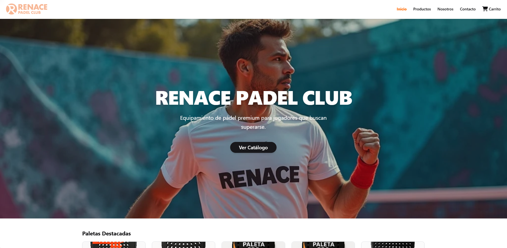
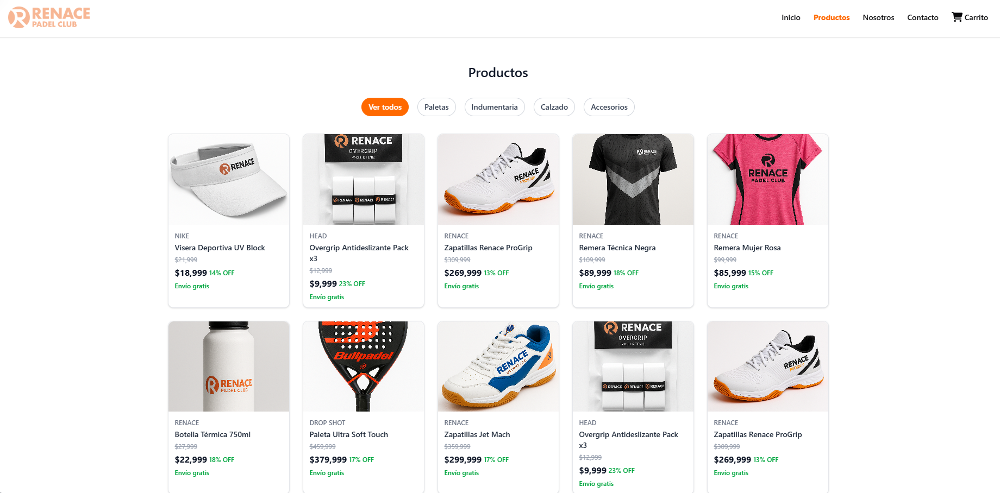
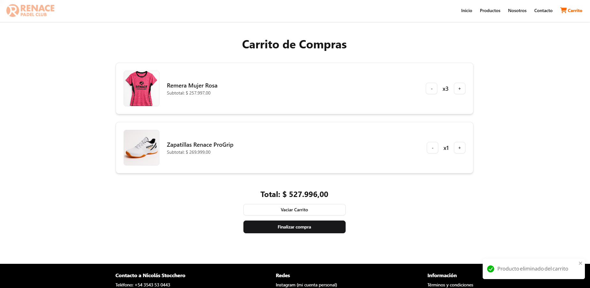
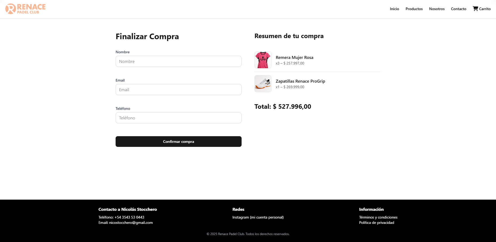
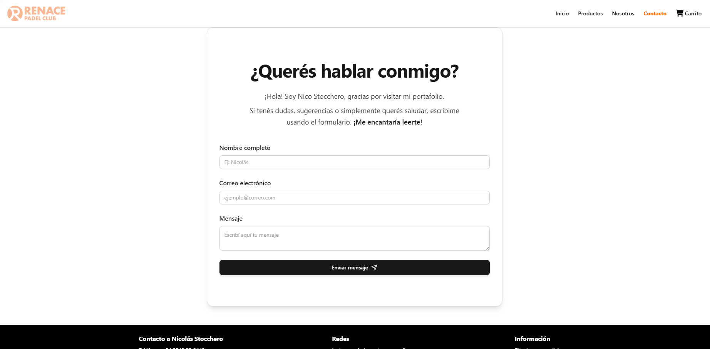
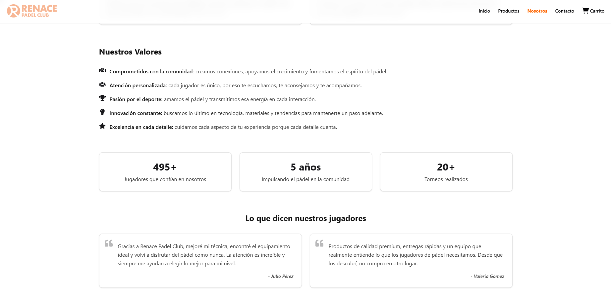

# 🏓 Renace Padel Club - E-commerce App

Renace Padel Club es una aplicación web de e-commerce diseñada para ofrecer una experiencia de compra optimizada a jugadores de pádel. Desarrollada como proyecto académico, esta Single Page Application (SPA) utiliza **React 19**, **Firebase Firestore**, **TailwindCSS 4** y **shadcn/ui** para lograr una interfaz moderna y responsiva. Además, incluye animaciones suaves con **Framer Motion** para mejorar la experiencia de usuario.

Este proyecto refleja buenas prácticas de desarrollo, una estructura modular y la aplicación de conceptos avanzados como Context API, desacoplamiento de responsabilidades y el principio de Responsabilidad Única (SRP).

---

## 🚀 Funcionalidades principales

✅ Listado de productos con filtro por categorías  
✅ Vista de detalle de cada producto  
✅ Carrito de compras con manejo global del estado mediante Context  
✅ Sistema de Checkout con generación de orden simulada en Firebase  
✅ Sección "Nosotros" profesional con storytelling, valores y testimonios  
✅ Formulario de contacto funcional con envío de datos vía EmailJS  
✅ Estilos responsivos y diseño profesional con TailwindCSS + shadcn/ui  
✅ Animaciones suaves para mejorar la experiencia de usuario (Framer Motion)  
✅ Renderizado condicional para loaders, mensajes de error y estados vacíos

---

## 🧱 Arquitectura y organización del proyecto

El proyecto está estructurado siguiendo principios de **Clean Code** y separación de responsabilidades. La estructura de carpetas facilita la escalabilidad y el mantenimiento:

/src
/assets
/components
/features
/about
/contact
/hero
/products
/cart
/layout
/ui
/context (manejo de estados globales)
/data (mock o datos semilla)
/hooks (custom hooks)
/lib (helpers y utilidades)
/pages (páginas principales)
/services (lógica de integración externa, como Firebase)
/utils (funciones generales)

---

### Principios aplicados

- **Responsabilidad Única (SRP)**: cada componente tiene una tarea específica.
- **Modularidad**: separación clara entre lógica de negocio (Context, servicios), lógica de UI (componentes) y helpers (utils).
- **Escalabilidad**: estructura preparada para futuras funcionalidades como autenticación, panel de administración o integraciones avanzadas.

---

## 🔥 Aprendizajes clave

✅ Manejo de estado global con Context API y renderizado condicional eficiente  
✅ Buenas prácticas en React: hooks, useEffect con dependencias correctas, desacople de lógica  
✅ Integración con Firebase Firestore para persistencia de datos y manejo de operaciones asíncronas  
✅ Uso de TailwindCSS + shadcn/ui para crear una UI moderna y escalable  
✅ Animaciones con Framer Motion para mejorar la UX  
✅ Planificación con pseudocódigo antes de codificar para diseñar la arquitectura correctamente  
✅ Comprender la importancia de validar datos antes de subir a Firebase, evitando duplicados  
✅ Modularizar helpers, lógica de negocio y componentes para mantener la claridad y la escalabilidad

---

## 💡 Áreas de mejora

- Refactorizar la lógica del Checkout para implementar transacciones reales en Firebase
- Validar el stock en tiempo real para manejar escenarios de alta concurrencia
- Implementar tests unitarios para componentes clave
- Añadir autenticación de usuarios y roles para un sistema más completo

---

## 🖼️ Capturas del proyecto

### 🏠 Home



### 📋 Listado de productos



### 🛒 Carrito de compras



### 💳 Checkout



### 🙋‍♂️ Contacto



### 📖 Nosotros



---

## 📦 Instalación y ejecución

1️⃣ Clona el repositorio

```bash
git clone https://github.com/NicoStocchero/Stocchero-Ecommerce
```

2️⃣ Instala las dependencias

```bash
npm install
```

3️⃣ Corre el proyecto en modo desarrollo

```bash
npm run dev
```

4️⃣ Abre en el navegador

```bash
http://localhost:5173
```

---

## 📚 Tecnologías y librerías usadas

- **React 19**
- **React Router DOM**
- **Firebase Firestore**
- **TailwindCSS 4** + **shadcn/ui**
- **Framer Motion**
- **EmailJS**
- **React Toastify**
- **Lucide React (íconos)**
- **SweetAlert2**
- **Validator.js**

---

## 📄 Licencia

Este proyecto fue desarrollado con fines educativos, como parte de una entrega académica. Puedes utilizar el código como referencia o punto de partida para tus propios proyectos, siempre que realices las adaptaciones necesarias y no lo utilices de forma directa en proyectos comerciales sin modificaciones.

---
